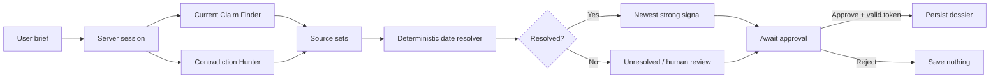

# The Verifier

> An adversarial fact-verification console that finds conflicting evidence, compares machine-readable source dates, and blocks persistence until a human approves it.

Built for the **TrueForge Agent Harness Hackathon** by WeMakeDevs × TrueFoundry.

## Why this exists

People often enter important meetings with claims gathered from a quick search: a person's current role, a company's leadership, or another fact that may have changed. Search ranking does not guarantee recency, and an AI-generated answer can hide disagreement between sources.

The Verifier takes one narrow brief, sends two research lanes in opposite directions, exposes any contradiction, and uses deterministic date metadata—not model intuition—to identify which source is newer. If the evidence is weak or ambiguous, it says so. Nothing is saved until the user explicitly approves it.

## What makes it different

- **Adversarial research:** a Current Claim Finder and Contradiction Hunter run concurrently.
- **Visible disagreement:** conflicting sources remain visible instead of being silently averaged into one answer.
- **Deterministic resolution:** raw JSON-LD, Open Graph, HTML metadata, and HTTP headers are normalized and compared by code.
- **Fail-closed evidence policy:** weak, invalid, tied, or single-source dates return `unresolved`.
- **Real approval boundary:** the server issues a one-time approval token and refuses to persist a dossier without it.
- **No-secret demo:** fixture mode works locally without model or provider credentials.

## Demo case

The pinned fixture demonstrates a leadership change using two official Starbucks releases:

| Research lane | Official source | Claim in the source | Published |
|---|---|---|---|
| Current Claim Finder | [Starbucks names Brian Niccol as Chairman and CEO](https://about.starbucks.com/press/2024/starbucks-names-brian-niccol-as-chairman-and-chief-executive-officer/) | Brian Niccol was named Chairman and Chief Executive Officer. | 2024-08-13 |
| Contradiction Hunter | [Starbucks reports Q3 fiscal 2024 results](https://about.starbucks.com/press/2024/starbucks-reports-q3-fiscal-2024-results/) | The release identifies Laxman Narasimhan as CEO. | 2024-07-30 |

Fixture dates are controlled raw metadata inputs for a repeatable demo. Live mode accepts only structured results returned by TrueForge and does not invent missing sources or dates.

## How it works



### Date-evidence policy

The resolver evaluates source-local signals in this order:

1. JSON-LD `dateModified` and `datePublished`
2. Open Graph `article:modified_time` and `article:published_time`
3. Standard HTML date metadata
4. HTTP `Last-Modified` as weak corroboration only

A result requires two independent sources with strong date evidence and a unique newest timestamp. Raw values, normalized UTC values, strength, and provenance are preserved for inspection.

## Architecture

| Layer | Responsibility |
|---|---|
| React + Vite UI | Brief entry, opposing evidence lanes, resolver table, approval state, and dossier summary |
| Node HTTP server | Session state machine, workflow execution, approval-token validation, and dossier persistence |
| Research adapters | Credential-free fixture adapter or TrueForge session/turn adapter |
| Metadata resolver | Pure shared module for deterministic extraction, normalization, and recency policy |
| TrueForge | Persistent live sessions, delegated research prompts, tool use, and structured turn results |

No TrueForge token or model credential is exposed to browser code.

## Repository structure

```text
server/
  app.js                 Session API and approval-gated persistence
  index.js               Runnable server entrypoint
  research.js            Fixture and TrueForge research adapters
src/
  App.jsx                Verification console UI
  lib/dateMetadata.js    Shared deterministic resolver
  lib/verifierApi.js     Browser client for session and approval APIs
test/
  dateMetadata.test.js   Resolver policy and edge cases
  research.test.js       Parallel workflow and TrueForge HTTP contract
  server.test.js         Session, approval, and persistence behavior
  verifierApi.test.js    Browser-to-server API contract
  ui/App.test.jsx        React workflow and failure states
design.md                UI behavior and visual specification
outputs/                 Product requirements and project documents
```

## Getting started

### Requirements

- Node.js 20 or newer
- npm

### Install

```bash
git clone https://github.com/Reet24-del/the-verifier.git
cd the-verifier
npm install
```

### Run the credential-free fixture

Start the backend:

```bash
npm run server
```

The API listens on `http://localhost:3001` by default. In a second terminal, start the interface:

```bash
npm run dev
```

Vite proxies `/api` to the local server on port `3001`, so the interface runs the real session workflow in fixture or TrueForge mode. For a separately hosted API, set `VITE_API_BASE_URL` when building the frontend.

### Run with TrueForge

Start a local TrueForge instance and configure an agent capable of public-web research. Then set:

```bash
export TRUEFORGE_BASE_URL="http://localhost:8790/api/v1"
export TRUEFORGE_AGENT_NAME="verifier-researcher"
# Optional when the TrueForge instance requires authentication:
export TRUEFORGE_TOKEN="your-server-side-token"
npm run server
```

`TRUEFORGE_AGENT_ID` is accepted as a compatibility alias, but `TRUEFORGE_AGENT_NAME` matches the current TrueForge session API.

Live research follows the official HTTP flow:

1. Create a persistent session.
2. Start a non-streaming turn for each research angle.
3. Poll each turn until `done`, `error`, or `cancelled`.
4. Validate the returned structured source JSON.
5. Run the local deterministic resolver over the returned metadata inputs.

If live configuration is absent, the server automatically uses fixture mode.

## API

| Method | Route | Purpose |
|---|---|---|
| `GET` | `/health` | Service readiness |
| `POST` | `/api/sessions` | Create a session from a non-empty `brief` |
| `POST` | `/api/sessions/:id/workflow` | Run both research lanes and issue an approval token |
| `POST` | `/api/sessions/:id/approval` | Approve or reject using the server-issued token |
| `GET` | `/api/sessions/:id/dossier` | Retrieve a dossier only after it has been saved |

Example flow:

```bash
curl -X POST http://localhost:3001/api/sessions \
  -H 'content-type: application/json' \
  -d '{"brief":"Verify that Brian Niccol is CEO of Starbucks."}'
```

Use the returned session ID to run the workflow. Approval requires the token returned by that workflow response; a missing or incorrect token is rejected and writes no file.

## Testing

```bash
npm test
npm run build
```

The test suite covers:

- metadata priority, normalization, invalid values, ties, and weak-only evidence;
- independent-source requirements and ordinary-script parsing;
- concurrent opposing research lanes;
- TrueForge's real session/turn HTTP envelopes through a local fake server;
- failed, cancelled, malformed, and successful live turns;
- invalid approval tokens, rejection, persistence, and post-restart retrieval.
- browser session/workflow requests and server error propagation;
- React evidence, approval, saved, and recoverable error states.

Some restricted execution environments prohibit binding localhost ports. In that environment, socket-based integration tests report `EPERM`; pure resolver tests and the production build remain runnable.

## Security and safety boundary

- Session and approval IDs are generated with `crypto.randomUUID()`.
- A dossier is written only after workflow completion and explicit `approved: true` with the matching token.
- Rejection clears the token and persists nothing.
- Generated dossiers and environment files are ignored by Git.
- Live source URLs, claims, and metadata are structurally validated.
- Missing structured live output causes an error instead of synthetic evidence.
- Provider credentials remain server-side.

This project verifies public-source recency signals; it is not a substitute for legal, financial, identity, or background-check services.

## Three-minute demo flow

1. Enter the claim to verify.
2. Start the two opposing research lanes.
3. Surface the source conflict.
4. Inspect raw and normalized date metadata.
5. Explain the resolved or unresolved result.
6. Pause at the server-backed approval checkpoint.
7. Approve and show the saved dossier state.

## Project status

- [x] Product requirements and UI specification
- [x] Approval-gated server and persisted dossiers
- [x] Deterministic date-metadata resolver
- [x] Parallel fixture and TrueForge research adapters
- [x] Official TrueForge HTTP-envelope contract tests
- [x] Connect the React UI to the session API
- [ ] Add saved-dossier export after approval
- [ ] Complete live credentialed TrueForge rehearsal
- [ ] Attach Qodo review evidence and final demo video

The checklist is intentionally honest: incomplete integrations are not presented as finished hackathon evidence.

## Contributing

Keep changes narrow and reviewable:

1. Create a feature branch.
2. Add or update tests before changing behavior.
3. Run `npm test` and `npm run build`.
4. Open a pull request describing the user-visible change and safety impact.
5. Resolve automated and human review findings before merging.

Please do not commit `.env` files, provider tokens, or generated dossier JSON.

## Documentation

- [Product requirements](outputs/the-verifier-prd-revised.md)
- [UI design specification](design.md)
- [Implementation plan](docs/implementation-plan.md)

## Acknowledgements

Built for the TrueForge Agent Harness Hackathon hosted by [WeMakeDevs](https://www.wemakedevs.org/) and [TrueFoundry](https://www.truefoundry.com/).
